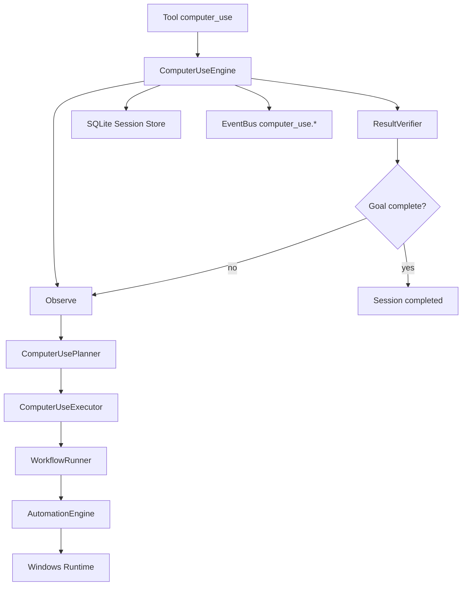
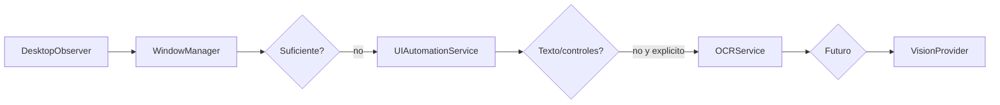

# Computer Use Runtime

Arquitectura de la capa `src/computer_use/` para evolucionar IA Local Agent hacia Computer Use local-first en Windows.

## Principios

- No reemplaza `LocalAgent`, `ToolExecutor`, `WorkflowRunner`, `EventBus` ni Windows Runtime.
- Usa APIs nativas primero, UI Automation segundo, OCR tercero y Vision como ultimo recurso futuro.
- No introduce dependencias cloud.
- No guarda screenshots persistentes por defecto.
- No automatiza credenciales, UAC, password managers, banking apps, admin tools ni secret stores.
- Las acciones pasan por `OSSecurityPolicy`, `ToolPermissionPolicy`, `PermissionsManager` y auditoria de tools.
- Las primitivas `move_mouse`, `click_mouse`, `press_key` quedan como fallback interno, no como interfaz principal.

## Arbol

```text
src/computer_use/
  __init__.py
  engine.py
  executor.py
  models.py
  capabilities/
    registry.py
  observer/
    desktop.py
    uia.py
    vision.py
  planner/
    planner.py
  sessions/
    store.py
  state/
    manager.py
  verifier/
    verifier.py
```

## Flujo Principal



## Orden De Observacion



El OCR solo se usa si se pide explicitamente o si un flujo futuro lo habilita bajo politica y confirmacion. Vision queda como contrato abstracto para fase 2.

## Modelos

- `ComputerUseSession`: goal, state, observations, actions, status y timestamps.
- `DesktopObservation`: ventana activa, ventanas abiertas, controles UIA, texto visible, resumen y fuentes usadas.
- `UIControl`: control semantico con nombre, tipo, automation id, flags de sensibilidad y metadata.
- `PlanStep`: capability semantica, descripcion, argumentos y expectativas.
- `Plan`: lista de pasos para un goal.
- `ExecutionGraph`: nodos y dependencias del plan.

## Eventos

El runtime publica:

- `computer_use.started`
- `computer_use.observed`
- `computer_use.planned`
- `computer_use.executed`
- `computer_use.verified`
- `computer_use.failed`
- `computer_use.completed`

## Tools

Categoria `computer_use`:

- `computer_use`
- `observe_desktop`
- `observe_window`
- `find_ui_control`
- `execute_workflow`
- `analyze_application`
- `automate_application`

Las tools de ejecucion requieren confirmacion. Las de observacion son read-only, y OCR solo se activa con parametro explicito.

## API

Router `computer_use`:

```http
POST /api/computer-use/run
POST /api/computer-use/observe
GET  /api/computer-use/sessions
GET  /api/computer-use/sessions/{session_id}
POST /api/computer-use/sessions/{session_id}/cancel
```

`run` ejecuta el ciclo Observe-Plan-Act-Verify con limite de iteraciones. `observe` devuelve una observacion estructurada sin OCR por defecto. La cancelacion es cooperativa y detiene sesiones activas antes de la siguiente iteracion.

## UI Tauri

La app desktop incluye un panel lateral `PC` implementado en:

```text
ui/desktop/src/features/computer-use/ComputerUsePanel.tsx
```

Muestra:

- Objetivo actual.
- Estado de sesion.
- Accion actual.
- Observacion reciente.
- Resultado/error.
- Sesiones recientes.
- Boton cancelar.

El panel no muestra logs internos crudos; emite eventos resumidos hacia el timeline.

## Seguridad

`HIGH_RISK_CAPABILITIES` requiere confirmacion:

- `click_ui_control`
- `fill_form`
- `organize_windows`
- `automate_task`
- `capture_and_analyze_screen`

Bloqueos obligatorios:

- Credenciales y campos password.
- UAC y pantallas admin.
- Password managers y secret stores.
- Browser passwords.
- Banking applications.
- Lectura de secretos.
- Ejecucion arbitraria de PowerShell.

## Persistencia

`ComputerUseSessionStore` guarda sesiones en SQLite:

```text
data/computer_use.sqlite3
```

Guarda observaciones y acciones como JSON. No guarda imagenes ni screenshots persistentes por defecto.

## Plan De Migracion

1. Usar `observe_desktop` y `observe_window` para panel UI y diagnostico.
2. Conectar panel Tauri "Computer Use" a eventos `computer_use.*`.
3. Ampliar planner determinista con planes especificos por app.
4. Implementar adaptador UIA real para `invoke_control` y `set_text`.
5. Anadir verificaciones por control/texto para workflows concretos.
6. Integrar VisionProvider local como ultimo recurso, sin dependencia cloud.

## Tareas Ejecutables

- Anadir streaming/progreso en vivo de sesiones Computer Use al panel Tauri.
- Persistir y exponer un timeline de eventos por sesion.
- Implementar `UIAutomationService.invoke_control` con `uiautomation`.
- Implementar `UIAutomationService.set_text` con bloqueo de password fields.
- Anadir tests de seguridad para controles sensibles.
- Anadir tests e2e para events `computer_use.*`.
